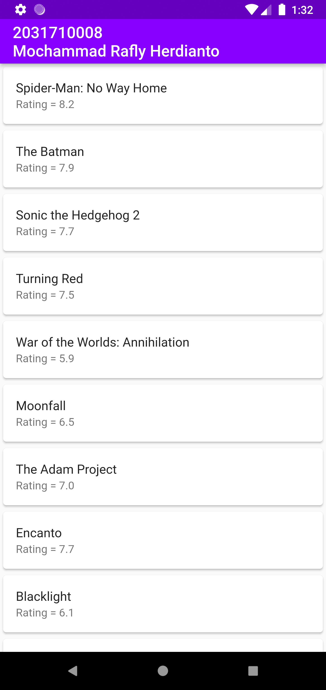
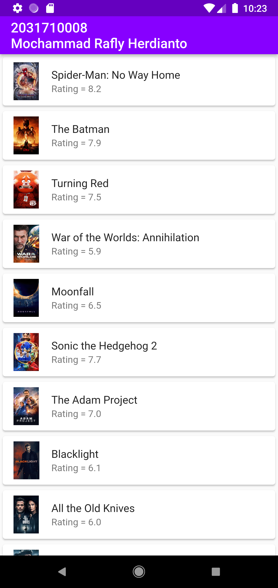
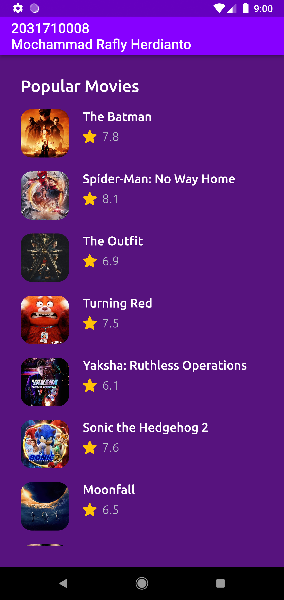
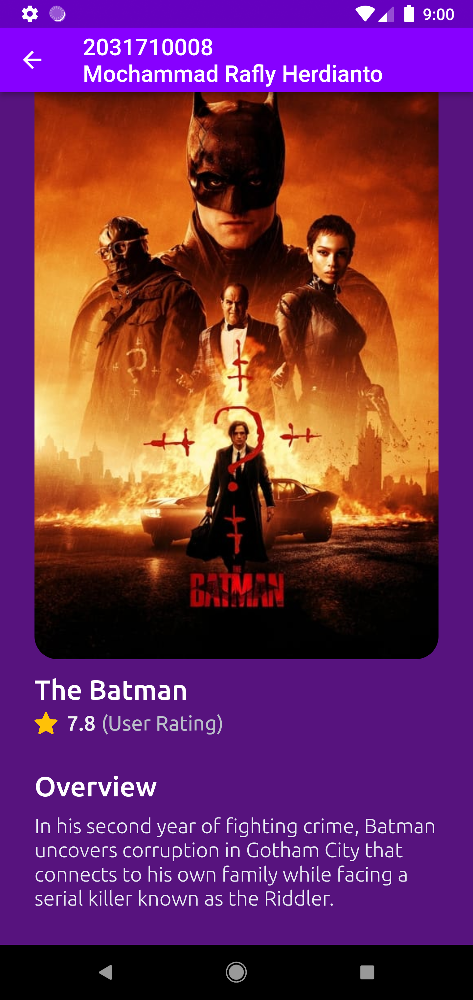

# Tugas 7 Pemrograman Mobile

Membuat Aplikasi Flutter Menggunakan API MovieDB

Nama  : Mochammad Rafly Herdianto  
NIM   : 2031710008  
Kelas : MI-2C  
Prodi : D3 MI  

## Hasil Praktikum

Halaman List Popular Movie
 

 

Halaman List Popular Movie Dengan Gambar
 

 

Halaman Detail Popular Movie Dengan Gambar
 

 

## Tugas

Modifikasi Halaman List Popular Movie Dengan Gambar
 

 

Modifikasi Halaman Detail Popular Movie Dengan Gambar
 

 
